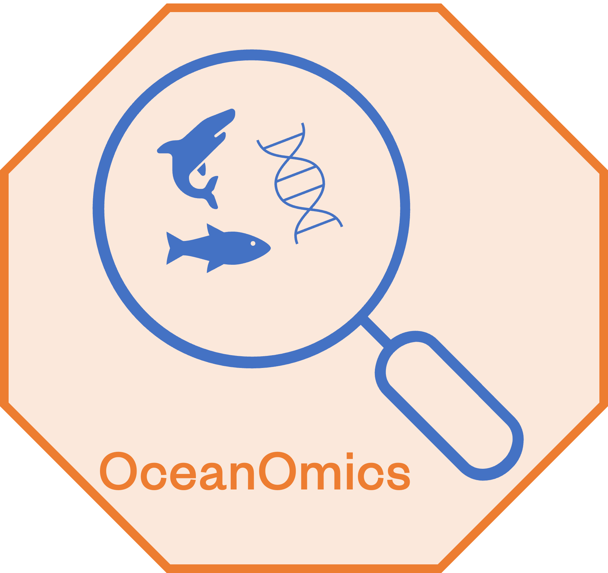

# OceanOmics Amplicon Pipeline

NOTE: This pipeline is now superseded by an implementation in nextflow, following the nf-core guidelines. It also integrates the eDNAflow pipeline and functionality, to reduce redundancy. Please use [MinderooFoundation/OceanOmics-amplicon-nf](https://github.com/MinderooFoundation/OceanOmics-amplicon-nf/tree/master) instead!

<p align="center">
  
</p>


## Overview
This repository contains the amplicon sequencing pipeline for taxonomic annotation of the samples collected in the OceanOmics project. It contains the `dada2` pipeline and 
a `blastn` query for taxonomic identification.

The scripts contained herein are:

```
00-setup.sh                            - to set up the analysis folder structure
01-demultiplex.sh                      - to demultiplex the amplicon data added to the 00-raw-data folder
02-rename_demux.sh                     - to rename the demultiplexed reads to their respective sample names; an index to sample name mapping file needs to be created
03-seqkit_stats.sh                     - to create read statistics for QC checks of the demultiplexed reads
04-DADA2.R                             - to trim the reads and create an amplicon sequencing variant table; Allows choosing pool option between TRUE, FALSE, and "pseudo". More information about the pool option can be found [here](https://benjjneb.github.io/dada2/pool.html)
05-run_LULU.sh                         - LULU is a tool to perform post-clustering curation of DNA amplicon data 
06-run_blast.sh                        - to query the NCBI nt and taxa database using BLAST
07.1-LCA_filter_nt_only.R	             - to remove BLAST hits in the nt database where the deposited species is very vague
07-run_LCA.sh                          - to retrieve the lowest common ancestor for the 16S and MiFish blast results
08-Decontam.R                          - sample decontamination; 
09-create_phyloseq_object.R            - create the phyloseq R package object for ease of analysis
Reorganise.sh                          - automates moving control samples into a Controls directory; this script is not needed unless you are using the 08-Decontam.R script
ecology_plots.R                        - phyloseq based ecology plots for initial alpha and beta diversity 
download_mitofish.sh                   - download the mitofish database
download_nt.sh                         - download the nt database and taxa database
blast                                  - all functions required for blast: blast-16S-MiFish.py, and run_blastnt.sh       
blast-16S-MiFish.py                    - to query a custom 16S fish database and the MiFish database from here: http://mitofish.aori.u-tokyo.ac.jp/download.html                        
run_blastnt.sh                         - blast against NCBI nt database
LCA                                    - LCA scripts and dependencies from [eDNAflow](https://github.com/mahsa-mousavi/eDNAFlow) pipeline 
LULU                                   - all functions required for LULU: 01-lulu_create_match_list.sh, and 02-LULU.R
report                                 - Rmarkdown script for creating the amplicon_report at the end of the pipeline
```

### Data

This repository comes with the OceanOmics 12S and 16S database for Australian fish in the `resources/` folder. This is OceanOmics' custom blast database: all sequences for Australian fish families were downloaded from NCBI nuccore and genbank, misclassified species were identified and removed, and outdated synonyms were replaced with the current accepted name as stored in Fishbase.

## Dependencies

### Install `miniconda`

To run this pipeline as smoothly as possible, please install `miniconda` on your system, as per the instructions [here](https://conda.io/projects/conda/en/latest/user-guide/install/linux.html). To speed up the installation process we also install [mamba](https://mamba.readthedocs.io/en/latest/installation.html). 

You can install miniconda and mamba at the same time by installing [mambaforge](https://github.com/conda-forge/miniforge#mambaforge).

### `conda` environments

This repository comes with a `env` folder, which allows to set up six different `conda` environments

- `renv` for a version controlled `R` environment including the `renv` package
- `amplicon` for all utilities required, e.g. `cutadapt`and `seqkit`
- `taxonkit` for taxonomy-related tasks
- `pytaxonkit`dependencies for the python script for the 16S and MiFish blast
- `blast-2.12.0` taxonomic annotation of ASVs
- `cutadapt-v4.1` for the cutadapt version 4.1

To create those environments, first install miniconda, use that to install mamba, then run the following:

```
mamba env create -f env/renv_environment.yml
mamba env create -f env/amplicon_environment.yml
mamba env create -f env/taxonkit.yml
mamba env create -f env/pytaxonkit.yml
mamba env create -f env/blast-2.12.0.yml
mamba env create -f env/cutadapt-v4.1
```

There's an alternative yml file in the folder for a 'general' environment outside of OceanOmics:

```
mamba env create -f env/amplicon_environment.general.yml
```

### Install `mmv`

This pipeline requires the linux utility `mmv` installed on your system.

Please install it with:

```
sudo apt-get update
sudo apt-get install mmv
```

## Databases
Databases can be downloaded with
```
bash scripts/download_nt.sh
bash scripts/download_mitofish.sh
```

## How To

### Bash scripts

#### Set up the analysis environment

Firstly, download this GitHub repository to your local file system, and cd into the repository's folder.

Then to set up the local folder-structure:

```
bash scripts/00-setup.sh -p myFirstProject
```

This will create a new folder containing subfolders for each step of the pipeline. The folder will be named myFirstProject_amplicon_analysis in the folder you're currently in.
The folder contains subfolders for all subsequent steps of the pipeline:

```
.
├── 00-raw-data
│   └── indices
├── 01-demultiplexed
├── 02-QC
├── 03-dada2
│   ├── errorModel
│   ├── QC_plots
│   └── tmpfiles
├── 04-LULU
├── 05-taxa
│   ├── blast_out
│   └── LCA_out
├── 06-report
├── databases
├── logs
└── scripts
    ├── blast
    ├── LCA
    ├── LULU
    └── report
```

The pipeline expects fastq of your amplicon sequencing data in the 00-raw-data/ folder. The files should be named `*${assay}*R1*fastq.gz` and `*${assay}*R2*.fastq.gz`.

All output and error messages are logged to a file in the `logs/` folder named after the respective step.

#### Global Variables

The Docker version of this pipeline (that's still in development) handles working directories within the Docker images using two global variables; CODE and ANALYSIS. If you are not using the Docker version of this pipeline, you need to manually set these global variables.

```
cd myFirstProject_amplicon_analysis
export ANALYSIS=$(pwd)
export CODE=$(pwd)/scripts
```

#### (optional) Demultiplexing

Some amplicon data needs to be demultiplexed. We store indices for demultiplexing in a voyageID/assayID structure. For each voyage and each assay we need two files in `00-raw-data/indices`: `voyageID_assayID_Fw.fa` and `voyageID_assayID_Rv.fa`. Please add these manually.

Then, to run the demultiplexing with those indices:

```
bash scripts/01-demultiplex.sh -v Voyage1 -a Assay1
```

For example, for a voyage named ABV4 and 16S assay:

```
bash scripts/01-demultiplex.sh -v ABV4 -a 16S
```
01-demultiplex.sh note: the -a argument can be used multiple times for multiple assays, the -c argument can be used to set the number of cores used (default = 50).

This example would expect a file named `ABV4_16S_Fw.fa` and `ABV4_16S_Rv.fa` in 00-raw-data/indices containing those indices for demultiplexing, looking like this:

```
>16S-sample1
CATGCCTA
>16S-sample2
TCGCCTTA
```

This example will also expect the raw fastq in 00-raw-data named like `*16S*fastq.gz*`.

`01-demultiplex.sh` will run cutadapt with all fastq files in `00-raw-data/` and the indices for this particular voyage/assay combination. The demultiplexed reads will be in `02-demultiplexed/assayID/`.

Check the log file named logs/01-demultiplex.log to see if any errors or warnings occurred. 

Now we need to rename the output files to correspond to their sample IDs.

```
bash scripts/02-rename_demux.sh -v Voyage1 -a Assay1
```
02-rename_demux.sh note: the -a argument can be used multiple times for multiple assays.

For each voyage's assay this script will rename the demultiplexed fastq files according to their sample ID.

`02-rename_demux.sh` expects a txt file, space-delimited, in `00-raw-data/indices/` which is named `Sample_name_rename_pattern_{Voyage1}_{Assay1}.txt` with the 'raw' filenames and the prettified filenames with sample IDs, for example:

```
16S-lane1-16S-L01.R[12].fq.gz Voyage1_Sample7_day4.#1.fq
16S-lane2-16S-L01.R[12].fq.gz Voyage1_Sample9_day14.#1.fq
```

#### (optional) Demultiplexing statistics

You can calculate statistics for each assay using the `03-seqkit_stats.sh` script:

```
bash scripts/03-seqkit_stats.sh -v Voyage1 -a Assay1
```
03-seqkit_stats.sh note: the -a argument can be used multiple times for multiple assays, the -c argument can be used to set the number of cores used (default = 50).

This will generate a txt file of QC statistics for each assay and voyage in the folder `02-QC/`.

#### Amplicon sequence variants via DADA2 


We run the R-script DADA2 to assemble amplicon sequence variants (ASVs) using [DADA2](https://benjjneb.github.io/dada2/index.html).

```
Rscript scripts/04-DADA2.R --voyage <VOYAGE_ID> \
                           --assay <ASSAY_ID> \
                           --pool <TRUE, FALSE or pseudo> \
                           --cores <default: 20> \
                           --minOverlap <default: 12> \
                           --mixMismatch <default: 0> \
                           > logs/04-DADA2.log 2>&1
```

We recommend to use `--pool TRUE` for the highest number of ASVs and detected species. See [this page](https://benjjneb.github.io/dada2/pseudo.html) with a longer discussion.

The final result are quality plots before and after read quality trimming, dereplicated reads, merged paired end reads with no chimeras, and .Rdata files for each step in case of step crashes. The end result is an amplicon sequence variant (ASV) table and a fasta of the ASV sequences. 

All results will be in `03-dada2/`.

#### LULU: post-clustering curation of DNA amplicon data

We use [LULU](https://github.com/tobiasgf/lulu) to curate the assembled ASVs. 

``` 
bash scripts/05-run_LULU.sh -v Voyage1 -a Assay1
```
05-run_LULU.sh note: the -a argument can be used multiple times for multiple assays

The final results are in 04-LULU and are curated ASVs in a fasta file along with LULU count tables and objects.

#### Taxonomic assignment via blastn

This step uses blastn to find taxonomic hits for the curated ASV fasta sequences.

Here is an example requesting 12 CPUs and writing final tsv-files in `05-taxa/`. Raw BLAST results are in `05-taxa/blast_out/`. Here we use the NCBI NT database (-d nt).

```
bash scripts/06-run_blast.sh -v Voyage1 -a Assay1 -d nt
```
06-run_blast.sh note: the -a argument can be used multiple times for multiple assays, the -c argument can be used to set the number of cores used (default = 50).

This script generates three log-files: one for the main script in `logs/06-run_blast.log`, one detailing the blast database for reproducibility reasons in `06-run_blast_nt_database_information.log`, and one detailing the actual blastn run depending on the user database choice in `logs/06-run_blast.nt.log`.

##### (optional) Taxonomic assignment via blastn: 16S and MiFish database

We can use a custom 16S or MiFish database, as well. All we need to change is the d flag. The script will assume that the name of the assay (here Assay1) is also the name of the blast database.

```
bash scripts/06-run_blast.sh -v Voyage1 -a Assay1 -d custom
```
06-run_blast.sh note: the -a argument can be used multiple times for multiple assays, the -c argument can be used to set the number of cores used (default = 50).

#### Finding the lowest common ancestor (LCA) for each query ASV

Now we try to find the 'best' hit for each query by merging all hits into their LCA species after filtering of blast hits: at least 98% identity and 100% query overlap.

```
bash scripts/07-run_LCA.sh -v Voyage1 -a Assay1 -db nt
```
07-run_LCA.sh note: the -a argument can be used multiple times for multiple assays.

`logs/07-run_LCA.log` contains the main run's output. Since this script downloads the taxonomy database from NCBI we retain this database for reproducibility reasons, it is stored in a folder starting with today's date and ending in 'taxdump'. There are two logs detailing this database: line-counts are in `logs/07-run_LCA_taxdump_linecounts.log` and md5sums are in `logs/07-run_LCA_taxdump_md5sums.log`.

When using NCBI-NT as the subject database, we use a helper script that removes sequences deposited in NCBI-NT with a vague taxonomic assignment.

```
Rscript scripts/07.1-LCA_filter_nt_only.R -v Voyage1 -a Assay1 > logs/07.1-LCA_filter.log 2>&1
```

The final LCAs are in the folder `05-taxa/LCA_out`. There are two LCA tables per assay - one for the filtered, and one for the unfiltered ASVs.

#### Decontaminating the LCA table

We assume that ASVs that appear in water or bleach controls are contaminations, and mark them as such in a new column 'Contamination'.

```
Rscript scripts/08-Decontam.R -v Voyage1 -a Assay1 -o nt > logs/08-Decontam.log 2>&1
```

This script is highly dependent on internal OceanOmics naming and is not recommended to be run by others.

#### Generating a final phyloseq object

We collate ASV information and taxonimic information into a phyloseq object for downstream analyses.

```
Rscript scripts/09-create_phyloseq_object.R -v ABV4 -a 16S -o nt -c 12 > logs/09-create_phyloseq_object.log 2>&1
```

This will generate a final phyloseq object in `06-report/` named like `Voyage1_Assay1_phyloseq_nt.rds`.

You can load that object into R:

```
> library(phyloseq)
> readRDS('06-report/Voyage1_Assay1_phyloseq_nt.rds')
```

It should print something like:

```
phyloseq-class experiment-level object
otu_table()   OTU Table:         [ 531 taxa and 203 samples ]
sample_data() Sample Data:       [ 203 samples by 5 sample variables ]
tax_table()   Taxonomy Table:    [ 531 taxa by 10 taxonomic ranks ]
phy_tree()    Phylogenetic Tree: [ 531 tips and 529 internal nodes ]
```

You can then follow any phyloseq tutorial, see the [phyloseq homepage](https://joey711.github.io/phyloseq)

##### (optional) Creating the amplicon report

An R markdown report showing some QC results can be created with:

```
bash scripts/10-amplicon_report.sh -v Voyage1 -a Assay1 -r Seq_run_ID
```
10-amplicon_report note: the -a argument can be used multiple times for multiple assays.

### Docker/Singularity and Nextflow

We are currently working on Docker/Singularity and Nextflow implementations of this pipeline.

## Authors and contributors
Jessica Pearce  
Sebastian Rauschert  
Priscila Goncalves  
Philipp Bayer  
Adam Bennett  
